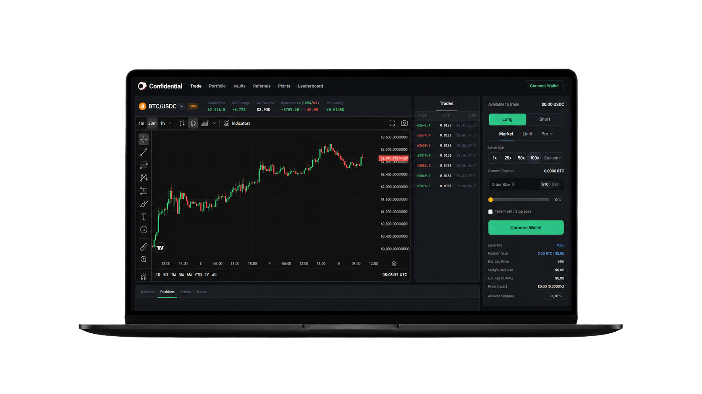
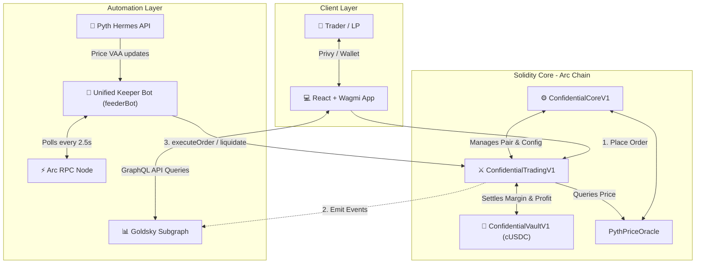

# 🛡️ Confidential DEX (V1)

[](https://testnet.arcscan.app)
[](./contracts/src)
[](./src)
[](https://goldsky.com)

A decentralized, institutional-grade perpetual trading platform built on the **Arc Network Testnet**. Confidential DEX combines the speed and responsiveness of centralized exchanges (CEXs) with 100% self-custody and trustless execution using a modular smart contract architecture, Pyth Oracle price feeds, and a decentralized keeper network.



---

## 🗺️ System Architecture

Confidential DEX employs an event-driven, keeper-automated execution pipeline. The system is split into three layers: the Client Web Application, the Smart Contract Execution Engine, and the Automation Infrastructure.



---

## 📁 Repository Structure

The codebase is organized as a monorepo consisting of the smart contract suite, the frontend web application, and the indexing subgraph:

```
├── contracts/               # Smart contract suite (Foundry/Hardhat)
│   ├── src/                 # Solidity contract source files
│   ├── test/                # Local Solidity unit & integration tests
│   ├── scripts/             # Contract deployment & configurations
│   └── feederBot.cjs        # PM2-compatible keeper bot (automated TP/SL, Limit, & Liquidations)
├── src/                     # Frontend web application (React, TS, Vite)
│   ├── abis/                # Contract ABI JSON artifacts
│   ├── components/          # Reusable UI components & modals
│   ├── config/              # RPC providers, chains, and Wagmi configs
│   ├── hooks/               # Custom React hooks (on-chain RPC & Subgraph readers)
│   ├── pages/               # Main application views (Trade, Vaults, Portfolio)
│   └── store/               # Zustand global state modules
├── subgraph/                # GraphQL indexing subgraph
│   ├── src/mapping.ts       # Subgraph event handlers (AssemblyScript)
│   ├── schema.graphql       # Subgraph database schemas
│   └── subgraph.yaml        # Subgraph manifest configuration
└── docs/                    # VitePress documentation site
```

---

## ⚙️ Protocol Core Mechanics

### 1. Dual-Tranche Vault (ERC-4626 cUSDC)
Platform liquidity is provided by depositors into a tokenized vault divided into two risk-reward segments (*tranches*) with a maximum absolute TVL cap of **$50,000,000 USDC**:

*   **Degen Vault (High Yield, High Risk):** Capped at **$15,000,000** (30% TVL). Earns **3x** the baseline share of trading fees, liquidation rewards, borrow fees, and trader losses. However, it takes the first hit during trader wins, allowing drawdown down to $0 (triggering an Epoch reset).
*   **Prime Vault (Capital Protected, Low Risk):** Capped at **$35,000,000** (70% TVL). Earns 1x baseline profit shares. Mechanically protected from bankruptcy by a strict **60% capital protection floor** (minimum 60% of historic assets cannot be drained by trader payouts).

### 2. Risk Management & Safeguards
*   **Utilization Cap (80%):** Trader positions cannot be opened if the vault cash utilization exceeds 80%. This guarantees a 20% cash buffer so LPs can withdraw their capital at any time.
*   **Emergency Auto-Deleveraging (ADL):** If high volatility causes vault utilization to surge past **95%**, the keeper network is authorized to force-close the most profitable trading positions to return liquidity to safe levels.
*   **Anti-MEV / Flash Loan Cooldown:** A mandatory 5-second cooldown is enforced between opening and closing a position to prevent sandwich and flash loan attack vectors.
*   **Dynamic Quadratic Price Impact:** To prevent market manipulation by whales, trade price impact is calculated exponentially relative to the pair's Open Interest. PAIR balancing trades (reducing skew) receive a **50% discount** on price impact.

### 3. Unified Keeper Economics (`feederBot.cjs`)
The network is automated by permissionless Keepers running the custom keeper bot:
*   **No-Cost Monitoring:** Keeper operations scan orders and positions via free RPC `eth_call` (Read-only), requiring 0 gas fees to monitor.
*   **Compensation Loop:** Execution commands (`executeOrder`, `liquidate`, `executeTPSL`) consume network gas + Oracle fee. The user pre-funds this using an `Execution Fee` (paid in `ARC`), which is instantly forwarded to the executing Keeper (`msg.sender`) upon a successful transaction.

---

## 📚 Documentation

For an in-depth understanding of the platform's tier-1 circuit breakers, quadratic price impacts, and security mechanisms, please read our comprehensive **[Platform Mechanics Guide](./resources/platform_mechanics.md)**.

---

## 📜 Contract Addresses (Arc Testnet)

| Contract | Address | Explorer Link |
| :--- | :--- | :--- |
| **ConfidentialCoreV1** | `0xC3EB0406FF2601D452673710e859Fbf75A0B892d` | [View Explorer](https://testnet.arcscan.app/address/0xC3EB0406FF2601D452673710e859Fbf75A0B892d) |
| **ConfidentialTradingV1** | `0x266C76800b5bdEd90c246AC60319831078fA28A4` | [View Explorer](https://testnet.arcscan.app/address/0x266C76800b5bdEd90c246AC60319831078fA28A4) |
| **ConfidentialVaultV1** | `0x5F4d94b9E92Bb09B647a2D044C488F1947427f4c` | [View Explorer](https://testnet.arcscan.app/address/0x5F4d94b9E92Bb09B647a2D044C488F1947427f4c) |
| **USDC Mock Token** | `0x3600000000000000000000000000000000000000` | [View Explorer](https://testnet.arcscan.app/address/0x3600000000000000000000000000000000000000) |
| **Pyth Oracle** | `0x897b9947185079B42d94CbbF332192CEFd9ACCFA` | [View Explorer](https://testnet.arcscan.app/address/0x897b9947185079B42d94CbbF332192CEFd9ACCFA) |

---

## 💻 Developer Setup & Installation

### Prerequisites
*   Node.js (v18+)
*   NPM (v9+)
*   [Foundry](https://book.getfoundry.sh/getting-started/installation) (for contract testing/development)

### 1. Smart Contracts
Navigate to the contracts directory and install dependencies:
```bash
cd contracts
npm install
```
To run local Solidity unit tests using Forge (Foundry):
```bash
forge test
```
To compile contracts:
```bash
forge build
```

### 2. Frontend Application
Navigate to the root directory and install dependencies:
```bash
npm install
```
Configure your environment variables in `.env` in the root:
```env
VITE_PRIVY_APP_ID=your_privy_app_id
VITE_ARC_RPC=https://rpc.testnet.arc.network
```
Run the local Vite development server:
```bash
npm run dev
```
Open `http://localhost:5173` in your browser.

### 3. Running the Keeper Bot
Run the background automation script to process limit orders, liquidations, and TP/SL:
```bash
cd contracts
# Set private key of the keeper wallet with testnet ARC gas
export PRIVATE_KEY=0xyour_keeper_private_key
node feederBot.cjs
```

---

## 🛡️ Audits & Security
This codebase is deployed on the **Arc Network Testnet** and represents a beta deployment. Do not use production funds. 

To report bugs, security vulnerabilities, or contribute improvements, please open a GitHub Issue or submit a Pull Request.

**Confidential DEX © 2026**
